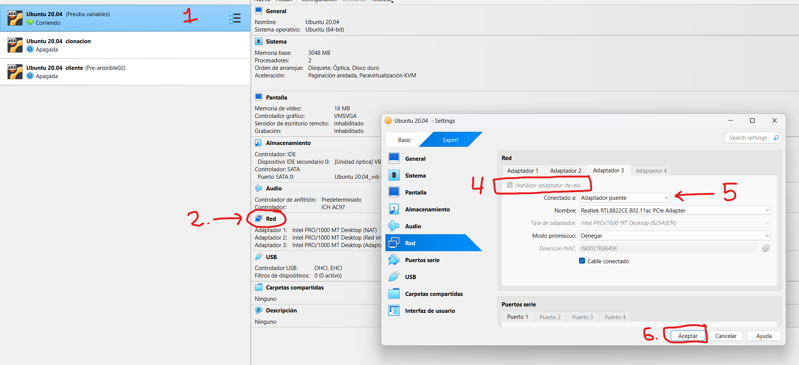
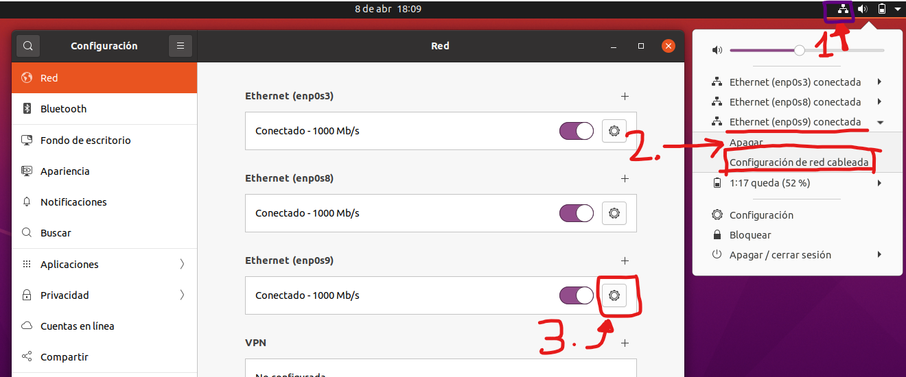
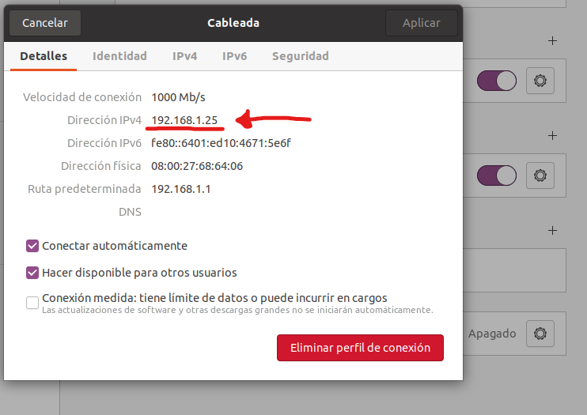
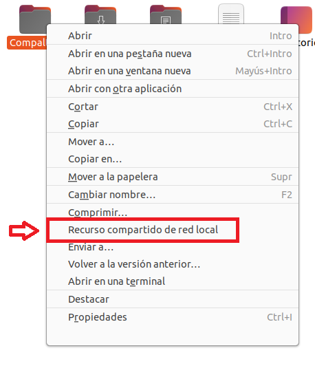
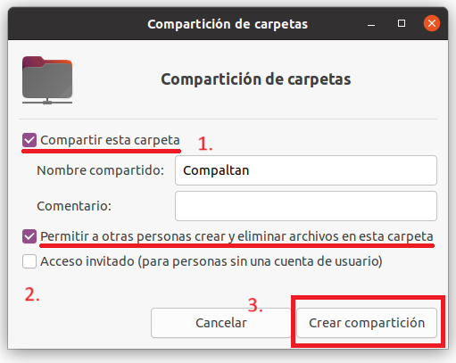
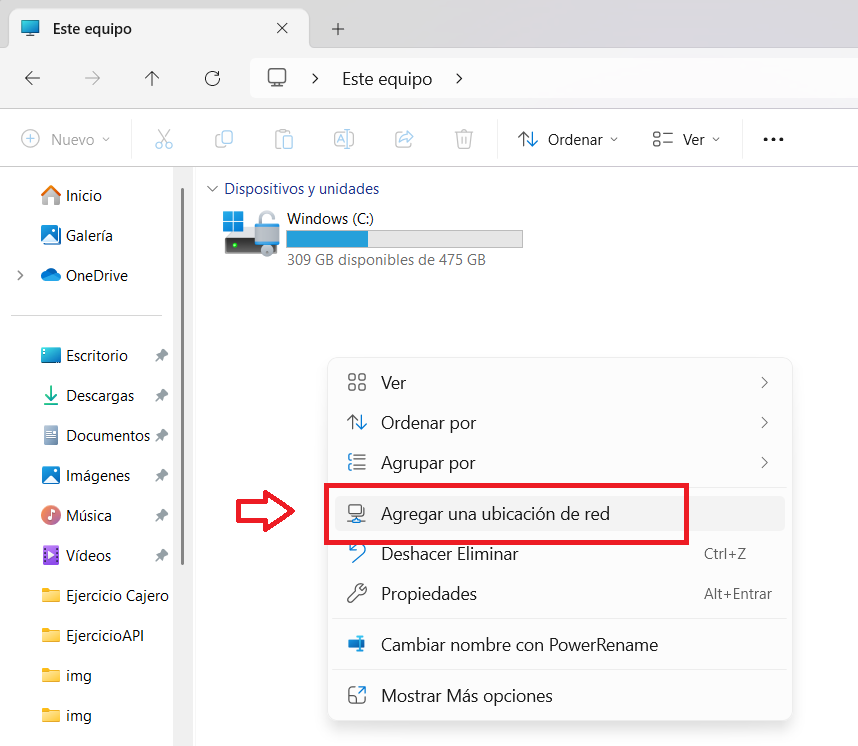
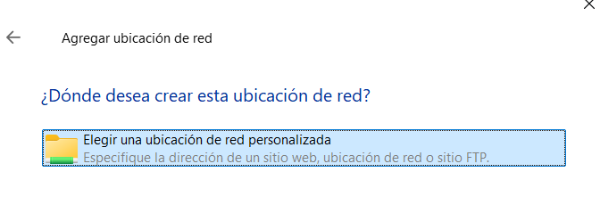
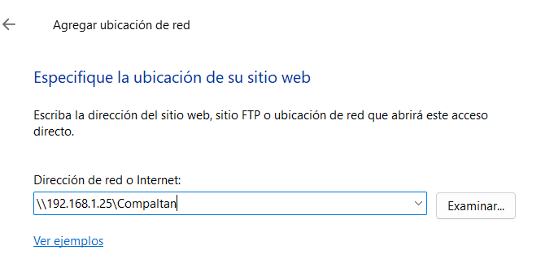
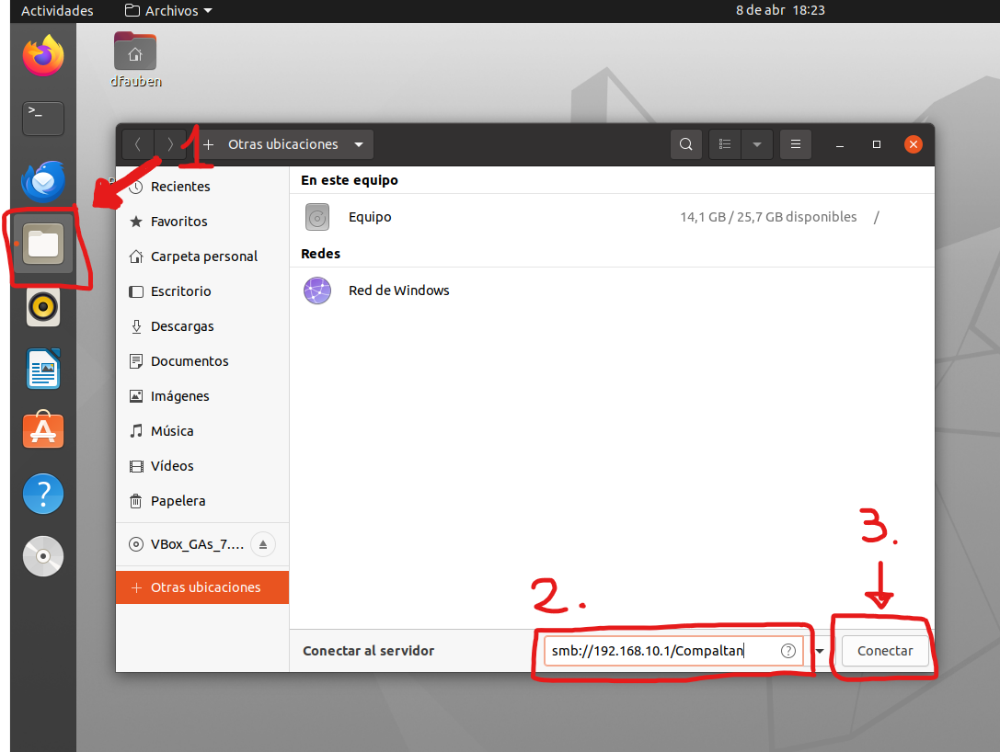
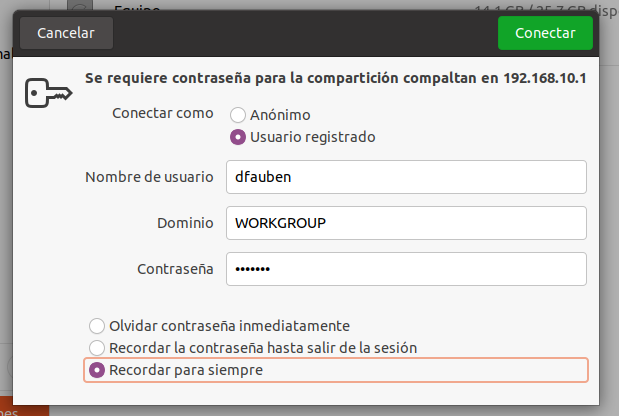

# 1- Añadir Adaptador Puente (Bridge) en VirtualBox



# 2- Instalar Samba

Desde ubuntu instalamos con:

````
sudo apt install samba
````

# 3- Contraseña de Samba

Creamos con:

````
sudo smbpasswd -a nombre_usuario
````

# 4- Conexion entre Ubuntu y Windows

Debemos conocer cual es la IP del adaptador bridge

Desde la interfaz grafica:





**ATENCION** CUIDADO CON LAS IPS DINAMICAS (DHCP)

# 5- Compartir una carpeta





# 6- Acceder desde Windows







# 7- Acceder desde Ubuntu
````
smb://nombre_del_servidor/nombre_del_recurso_compartido 
````

**En nombre del servidor ponemos la dirección del servidor por red interna**



